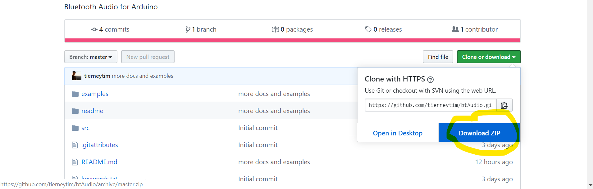
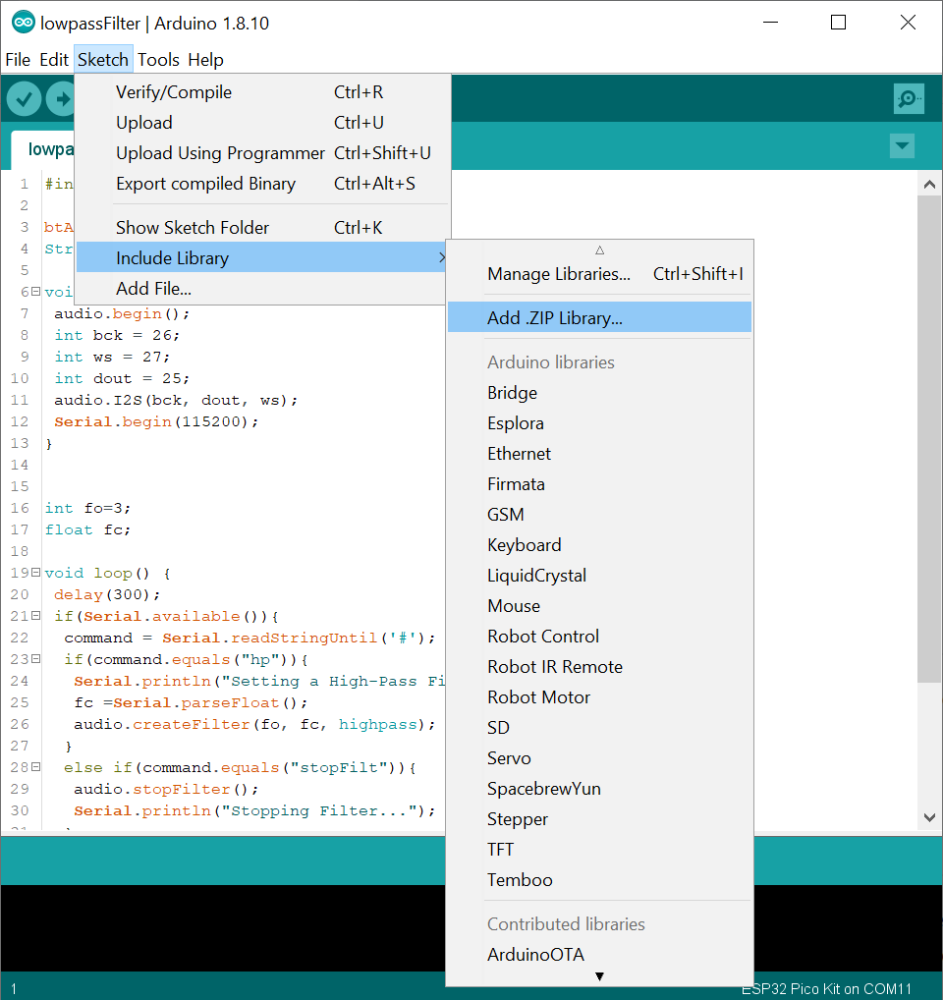
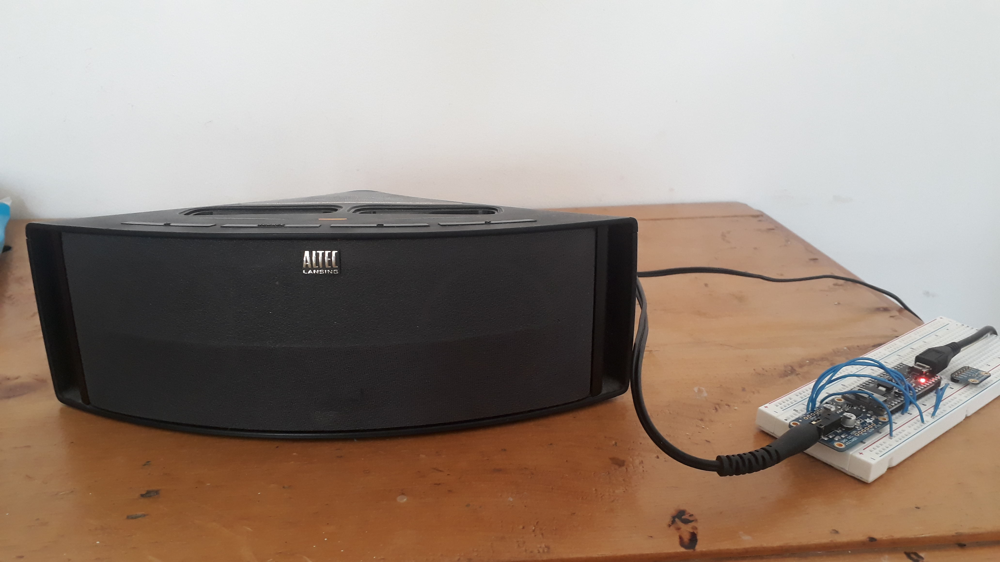

# Bluetooth Audio for Arduino
The code exposes the A2DP profile(Bluetooth Audio) available in ESP32 boards using the arduino interface. It assumes you have installed the [ESP32 core](https://github.com/espressif/arduino-esp32) for arduino and have an ESP32 board. I quite like the [TinyPico](https://www.tinypico.com/) because it's so powerful and so tiny! I also like the [ESP32-PICO-KIT](https://www.mouser.co.uk/ProductDetail/Espressif-Systems/ESP32-PICO-KIT?qs=MLItCLRbWsyoLrlknFRqcQ%3D%3D&vip=1&gclid=EAIaIQobChMImN2EgKTG6QIVWbvVCh0zcAPBEAQYASABEgK0kfD_BwE) because it's so powerful and cheap. Both have the same chips (i think) but the TinyPico is way smaller. 


## Table of contents
1. [Installation](#a)
2. [Advertising the Connection](#b)
3. [Simple Audio](#c)
	1. [Hardware: Components](#c1)
	1. [Hardware: Setup](#c2)
	2. [I2S](#c3)
4. [Changing Volume](#d)
5. [Serial Control](#e)
6. [High-Pass Filtering](#f)
7. [Low-Pass Filtering](#g)
8. [Dynamic Range Compression](#h)
	1. [DRC: Partial Control](#h1)
	2. [DRC: Full Control](#h2)
9. [Not so simple audio](#i)


<a name="a"></a>
## Installation
Download respoitory.
<p align="center">
  
</p>
 Within the arduino IDE under Sketch>>Include Library>> select "Add .ZIP library". Then select the downloaded zip file. 
<p align="center">
  
</p>
This should add the library. To use the library you'll have to include the relevant header in the arduino sketch. You'll see this in the following sketches

<a name="b"></a>
## Advertising the Connection
This section covers the [advertiseBluetooth](examples/advertiseBluetooth/advertiseBluetooth.ino) example.
The first step to getting some bluetooth audio up and running is to advertise your ESP32 board.  You will need to include the btAudio header and declare a `btAudio` object.
```cpp
#include <btAudio.h>

// Sets the name of the audio device
btAudio audio = btAudio("ESP_Speaker");
```
The string that you supply to the `btAudio` object becomes the name of the ESP32 bluetooth connection. However, this only initialises the object. It doesn't actually start the bluetooth. For that you'll need to use the `btAudio::begin` method.
 
 
```cpp
void setup() {
 
 // streams audio data to the ESP32   
 audio.begin();

}

void loop() {

}
```

Yay, now you can connect to your esp32 board and stream audio to it.  You can connect with your phone, laptop, MP3 player, whatever you want. Sadly, this data is stuck on the ESP32 unless you have a DAC (Digital to Analogue Converter) that can actually send the audio somewhere (speaker, Hi-Fi system). I'll cover that in the next section. Anywho the whole script is below.

```cpp
#include <btAudio.h>

// Sets the name of the audio device
btAudio audio = btAudio("ESP_Speaker");

void setup() {
 
 // streams audio data to the ESP32   
 audio.begin();

}

void loop() {

}
```
<a name="c"></a>
## Simple Audio
This section covers the [minimalAudio](examples/minimalAudio/minimalAudio.ino) example.
Now that we have mastered the bluetooth component of "Bluetooth Audio" let's turn to the audio part. This requires some extra hardware. I like the adafruit [I2S Stereo decoder](https://www.adafruit.com/product/3678). It takes data from the ESP32 and converts it to a line out signal  which can be plugged into a stereo or Hi-Fi system (instantly adding wireless audio to your audio system). But what is I2S and what extra hardware do you need?

<a name="c1"></a>
### Hardware: Components
You will need: 
* a Breadboard
* An ESP32 board. I like the [TinyPico](https://www.tinypico.com/) and the [ESP32-PICO-KIT](https://www.mouser.co.uk/ProductDetail/Espressif-Systems/ESP32-PICO-KIT?qs=MLItCLRbWsyoLrlknFRqcQ%3D%3D&vip=1&gclid=EAIaIQobChMImN2EgKTG6QIVWbvVCh0zcAPBEAQYASABEgK0kfD_BwE)
* Adafruit [I2S Stereo decoder](https://www.adafruit.com/product/3678).
* Micro USB cable
* 5 Jumper Wires (3 for I2S, 1 for power and 1 for ground)
* Aux cable/3.5mm headphones
* Speaker with Line in connection (if you're not using headphones).

<a name="c2"></a>
### Hardware: Setup
1. Set up the breadboard. There's a wiring guide for the I2S DAC over at [adafruit](https://learn.adafruit.com/adafruit-i2s-stereo-decoder-uda1334a/circuitpython-wiring-test). The connections to the DAC are the same. Just swap the outputs from the microcontroller in the  adafruit example to the pins you selected for the ESP32 in the [minimalAudio](examples/minimalAudio/minimalAudio.ino) example.
Mine looks like this. While making this project I didn't have access to jumper wires or a soldering iron (they were at my locked-down workplace). For the jumper wires I just cut up one long blue wire into as many wires as I needed. To attach pins to the DAC I used [Pimoroni push headers](https://shop.pimoroni.com/products/gpio-hammer-header?variant=35643241098). This is not ideal but cheaper than buying a termporary soldering iron. 
   
<p align="center">
  
</p>

2. Upload the [minimalAudio](examples/minimalAudio/minimalAudio.ino) example using the micro USB cable.

```cpp
#include <btAudio.h>

// Sets the name of the audio device
btAudio audio = btAudio("ESP_Speaker");

void setup() {
 
 // streams audio data to the ESP32   
 audio.begin();
 
 //  outputs the received data to an I2S DAC https://www.adafruit.com/product/3678
 int bck = 26; 
 int ws = 27;
 int dout = 25;
 audio.I2S(bck, dout, ws);
}

void loop() {

}
```

3. Disconenct USB from computer and power the ESP32 board from a USB power supply near the speaker. Don't worry about it losing power it will remember the code you uploaded previously.
4. Connect the Line out from the DAC to the the Line in on the stereo/Hi-Fi using your Aux cable. You could also used wired headphones instead of an Aux cable to a speaker.
My setup looks like this.
<p align="center">
  
</p>

5. On your laptop/phone connect to the ESP32 like you would any other bluetooth device.

6. Play some audio!

<a name="c3"></a>
### I2S
[I2S](https://www.arduino.cc/en/Reference/I2S) is method of digitally transfering audio data between devices. It uses just 3 wires. This is particularly useful in transferring data to an external high performance Digital to Analog Converter (DAC). For instance most ESP32s have 2 8-bit DACs whereas music is usually played over 16-bit DACs (or better). However, you can get cheap 16 bit DACs that you can plug into your speakers/Hi-Fi systems. These DACs receive data from your microcontroller using I2S. The one I have been using is the Adafruit [I2S Stereo decoder](https://www.adafruit.com/product/3678). Not all microcontrollers have I2S communication and Bluetooth Classic/ WIFI. This is why the ESP32 boards are key here. They have both. A simple bit of code to combine both the bluetooth and the I2S is given below. the only difference between this code and the advertising code is calling the `btAudio::I2S` method and specifying the 3 pins that you want to use. A cool feature about ESP32s is that you usually pick whatever pins to do whatever action you want. So feel free to change the pins.

```cpp
#include <btAudio.h>

// Sets the name of the audio device
btAudio audio = btAudio("ESP_Speaker");

void setup() {
 
 // streams audio data to the ESP32   
 audio.begin();
 
 //  outputs the received data to an I2S DAC https://www.adafruit.com/product/3678
 int bck = 26; 
 int ws = 27;
 int dout = 25;
 audio.I2S(bck, dout, ws);
}

void loop() {

}
```

<a name="d"></a>
## Changing Volume
This section covers the [changeVolume](examples/changeVolume/changeVolume.ino) example.
Volume is a tricky issue. Ideally, the sender should issue a  request for volume to be changed at the receiver (using something like [AVRCP](https://en.wikipedia.org/wiki/List_of_Bluetooth_profiles#Audio/Video_Remote_Control_Profile_(AVRCP))). The sender should not change the data before it is transmitted. My MP3 player does not change the data before transmission. My laptop and phone do. One option is to digitally alter the data before it goes to the DAC but after it has been received by the ESP32. We can do this by using the `btAudio::volume` method. It accepts one argument: a floating point number between 0 and 1. It then scales the data by that number. A super cool feature of many ESP32s is that they have two cores. One can do all the setup/ audio on one core (core 0) while the other can handle the user interface (core 1). Any code put in `void loop()` will run on core 1. We'll take advantage of that in later sections.

```cpp
#include <btAudio.h>

// Sets the name of the audio device
btAudio audio = btAudio("ESP_Speaker");

void setup() {
 
 // streams audio data to the ESP32   
 audio.begin();
 
 //  outputs the received data to an I2S DAC https://www.adafruit.com/product/3678
 int bck = 26; 
 int ws = 27;
 int dout = 25;
 audio.I2S(bck, dout, ws);
}

void loop() {
delay(3000);
audio.volume(0.1);
delay(3000);
audio.volume(1.0);
}
```
<a name="e"></a>
## Serial Control
This section covers the [serialControl](examples/serialControl/serialControl.ino) example.
If you want to control any of the features proposed here you may need to create a hardware interface (buttons, potentiometers, etc). In the meantime I've created a serial interface for you to play with.  It's pretty simple and not necessarily the best method but it works. The idea is to send a string to over the comm port (e.g. `vol`). Follow this string with a terminator(e.g. `#`) and then follow this with a number (e.g. `0.42`). So the full comand to cut the volume by half would be `vol#0.5`. Once the code in the next section is uploaded try and experiment by opening the serial monitor and changing the volume a bit. This general approach can be adpated for any method. 
```cpp
#include <btAudio.h>

btAudio audio = btAudio("ESP_Speaker");
String command;

void setup() { 
 audio.begin();
 int bck = 26; 
 int ws = 27;
 int dout = 25;
 audio.I2S(bck, dout, ws);
 // open the serial port
 Serial.begin(115200);
}


void loop() {
 delay(300);
 // check if data is available 
 if(Serial.available()){
  //read until a terminator. after this point there should only be numbers
  command = Serial.readStringUntil('#');
  if(command.equals("vol")){
   //read and set volume	  
   float vol =Serial.parseFloat();
   Serial.println("Changing Volume");
   audio.volume(vol);
  }
 }
}
```

<a name="f"></a>
## High-Pass Filtering
This section covers the [highpassFilter](examples/highpassFilter/highpassFilter.ino) example.
High-Pass filters remove low frequency content from your data. You can either set the parameters in the `void setup()` section or you can interactively edit the parameters via the serial interface. The method is `btAudio::createFilter`. The implementation uses a cascade of [biquad filters](https://www.earlevel.com/main/2012/11/26/biquad-c-source-code/).
The method takes three arguments. The first specfies the number of filter cascades. A higher number makes the filter sharper but increases the run-time of the method. For me a value of 3 is a good compromise between computation time and filter efficacy. The second argument is the filter cutoff. Below this frequency the  signal starts to get suppressed. The third argument is the filter type. setting the value to `highpass` makes the filter a high-pass filter. Calling the `stopFilter()` method stops the effects of the filter(send command `stopFilt#`). Experiment with a few values for your high pass cut off. Most speakers struggle to produce sound below 100Hz so sending the command `hp#100` should only make a very small difference to your listening. Send the command `hp#600` and you will notice a very big difference! The sound will sound like it's coming through a very old phone...
```cpp
#include <btAudio.h>

btAudio audio = btAudio("ESP_Speaker");
String command;

void setup() { 
 audio.begin();
 int bck = 26; 
 int ws = 27;
 int dout = 25;
 audio.I2S(bck, dout, ws);
 Serial.begin(115200);
}


int fo=3;
float fc=30;

void loop() {
 delay(300);
 if(Serial.available()){
  command = Serial.readStringUntil('#');
  if(command.equals("hp")){
   Serial.println("Setting a High-Pass Filter...");
   fc =Serial.parseFloat();
   audio.createFilter(fo, fc, highpass);
  }
  else if(command.equals("stopFilt")){
   audio.stopFilter();
   Serial.println("Stopping Filter...");
  }   
 }
}

```

<a name="g"></a>
## Low-Pass Filtering
This section covers the [lowpassFilter](examples/lowpassFilter/lowpassFilter.ino) example. Low-Pass filters suppress high frequency signals in your audio. Creating one is very similar to the High-Pass filter example. It only requires you to change the third argument from `highpass` to `lowpass` in the `btAudio::createFilter` method. We can similarly use the serial interface to change the frequency cutoff (`lp#10000`). Sets a 10000Hz Low-Pass Filter. Lowering this setting creates a more muffled sound (like listening to audio through a wall or under water). As a side note, if you send the `hp#100` and `lp#14000` commands you will create a Band-Pass Filter with cutoffs at 100Hz & 14000Hz. `stopFilt#` will once again turn off the filters. 

```cpp
#include <btAudio.h>

btAudio audio = btAudio("ESP_Speaker");
String command;

void setup() { 
 audio.begin();
 int bck = 26; 
 int ws = 27;
 int dout = 25;
 audio.I2S(bck, dout, ws);
 Serial.begin(115200);
}


int fo=3;
float fc;

void loop() {
 delay(300);
 if(Serial.available()){
  command = Serial.readStringUntil('#');
  if(command.equals("hp")){
   Serial.println("Setting a High-Pass Filter...");
   fc =Serial.parseFloat();
   audio.createFilter(fo, fc, highpass);
  }
  else if(command.equals("stopFilt")){
   audio.stopFilter();
   Serial.println("Stopping Filter...");
  } 
  else if(command.equals("lp")){
   Serial.println("Setting a Low-Pass Filter...");
   fc =Serial.parseFloat();
   audio.createFilter(fo, fc, lowpass);
  }  
 }
}

```
<a name="h"></a>
## Dynamic Range Compression
I'll highlight terms throughout this section that will be paramters for the [Dynamic range compression(DRC)](https://en.wikipedia.org/wiki/Dynamic_range_compression). DRC is a method that evens out the sound of audio.  It compresses loud sounds to the level of quiet ones and then, optionally, amplifies(`gain`) both. The result is a more even audio experience. It is nonlinear and has many, many settings. It is both compicated to implement and to use. Consider this feature experimental. There are two main types of compression: Hard Knee and Soft Knee. Basically, once the audio reaches a certain `threshold` it starts to be compressed by a certain `Ratio`. Hard knee compressors start compressing immediately at the `threshold` but Soft knee compressors start compressing sooner and in a more smooth fashion. Supposedly, this leads to a more natural sound but it is far more computationaly intensive to implement.   
<a title="Iainf / Public domain" href="https://commons.wikimedia.org/wiki/File:Compression_knee.svg"></a>

You can also specify the `width` of this soft knee (i.e. How gradual you want the compression to be). Setting this `width` to zero implements a hard knee. You can alsoe set `attack` and `release` times. These are time constants that determin how quickly the compressor starts working. For instance if there was a sudden change in volume you might want to have a very quick `attack` time so as to compress that signal quickly. Having a long `release` time will leave the compressor running for a brief time after it has started compressing. I've got two examples on how to use the compressor. One has extreme parameters that you can just turn on or off and another with full serial control over all the parameters. 


<a name="h1"></a>
### DRC: Partial Control
This section covers the [partialDRC](examples/partialDRC/partialDRC.ino) example. 
For turning the compressor on and off just send the `compress#` and `decompress#` commands over the serial port. This will call the `btAudio::compress` method and the `btAudio::decompress` method. Hopefully, you should hear a clear difference between compressed and uncompressed data. It can be quite useful for making sure audio will never clip a set of speakers and for watching tv shows that have very loud background music and very low vocals. I'm looking at you xxxxxxx! 
```cpp
#include <btAudio.h>

btAudio audio = btAudio("ESP_Speaker");
String command;

void setup() { 
 audio.begin();
 int bck = 26; 
 int ws = 27;
 int dout = 25;
 audio.I2S(bck, dout, ws);
 Serial.begin(115200);
 
}

float thresh=30;
float attack=0.1;
float release= 0.2;
float ratio = 10;
float width= 10;
float gain=0;

void loop() {
 delay(300);
 if(Serial.available()){
  command = Serial.readStringUntil('#');
   if(command.equals("compress")){
    Serial.println("Applying Compression");
    audio.compress(thresh,attack,release,ratio,width,gain);
   }
   else if(command.equals("decompress")){
    Serial.println("Releasing Compression");
    audio.decompress();
   }
  }
}
```

<a name="h2"></a>
### DRC: Full Control
This section covers the [fullDRC](examples/fullDRC/fullDRC.ino) example. Examples of the commands to control the individual parameters are as follows:
* compress#
* decompress#
* gain#0
* thresh#25
* attack#0.1
* release#0.1
* ratio#10
* width#10

The actual code that does the compression is the same but the serial interface is more verbose.

```cpp
#include <btAudio.h>

btAudio audio = btAudio("ESP_Speaker");
String command;

void setup() { 
 audio.begin();
 int bck = 26; 
 int ws = 27;
 int dout = 25;
 audio.I2S(bck, dout, ws);
 Serial.begin(115200);
}

float thresh=30;
float attack=0.1;
float release= 0.2;
float ratio = 10;
float kneeWidth= 1;
float gain=0;

void loop() {
 delay(300);
 if(Serial.available()){
  command = Serial.readStringUntil('#');
   if(command.equals("compress")){
    Serial.println("Applying Compression");
    audio.compress(thresh,attack,release,ratio,kneeWidth,gain);
   }
   else if(command.equals("decompress")){
    Serial.println("Releasing Compression");
    audio.decompress();
   }
   else if(command.equals("gain")){
    gain =Serial.parseInt();
    Serial.println((String)"Compressing with a gain of "+gain);
    audio.compress(thresh,attack,release,ratio,kneeWidth,gain);
   }
   else if(command.equals("thresh")){
    thresh =Serial.parseFloat();
    Serial.println(thresh);
    Serial.println((String)"Compressing with a threshold of " + thresh + "dB");
    audio.compress(thresh,attack,release,ratio,kneeWidth,gain);
   }
   else if(command.equals("attack")){
    attack =Serial.parseFloat();
    Serial.println((String)"Compressing with an attack time of " + attack*1000 + "ms");
   audio.compress(thresh,attack,release,ratio,kneeWidth,gain); 
   }
   else if(command.equals("release")){
    release =Serial.parseFloat();
    Serial.println((String)"Compressing with an release time of " + release*1000 + "ms");
    audio.compress(thresh,attack,release,ratio,kneeWidth,gain);
   }
   else if(command.equals("ratio")){
    ratio =Serial.parseFloat();
    Serial.println((String)"Compressing with a Ratio of " + ratio);
    audio.compress(thresh,attack,release,ratio,kneeWidth,gain);
   }
   else if(command.equals("width")){
    kneeWidth =Serial.parseInt();
    Serial.println((String)"Compressing with a knee width of " + kneeWidth + "dB");
    audio.compress(thresh,attack,release,ratio,kneeWidth,gain);
   }
  }
}

```
<a name="i"></a>
## Not so simple audio
What if [you hate classes/Object Oriented Programming](https://medium.com/better-programming/object-oriented-programming-the-trillion-dollar-disaster-92a4b666c7c7 ) and don't want to use my code but still want Bluetooth audio. Well this section covers just how to do that with the [underTheHood](examples/underTheHood/underTheHood.ino) example. It uses the minimum amount of ESP32 code to get audio output on I2S. I ain't gonna explain this. The reason I wrote the library is so that I wouldn't have to explain low level ESP32 code. However, for developers it may be easier to work with the raw ESP32 code as you can see the all the moving parts and dependencies more easily. However, for an end user(not a developer) I think a class based approach that hides these details is the way to go. Whatever your thoughts, I think I'm unlikely to shift from the object-oriented programming to more functional programming for this library. 

On a technical note this code adapts the [ESP-IDF A2DP Sink](https://github.com/espressif/esp-idf/blob/master/examples/bluetooth/bluedroid/classic_bt/a2dp_sink/main/main.c
) example but uses the [arduino-esp32 library](https://github.com/espressif/arduino-esp32) . There are very subtle differences between these libraries. So this example will only work with the arduino library, not the ESP-IDF library. You'll need to use the much more complicated [ESP-IDF example](https://github.com/espressif/esp-idf/blob/master/examples/bluetooth/bluedroid/classic_bt/a2dp_sink/main/main.c
) if you work outside the arduino environment. 

```cpp
// cricial audio bits taken from https://github.com/espressif/esp-idf/blob/master/examples/bluetooth/bluedroid/classic_bt/a2dp_sink/main/main.c

// bluetooth, config, discover and audio
#include "esp_bt_main.h"
#include "esp_bt_device.h"
#include "esp_gap_bt_api.h"
#include "esp_a2dp_api.h"


// the audio DAC and amp configuration. 
#include "driver/i2s.h"

//globals


// the callback(processes bluetooth data).
// this is the most important function. 
void bt_data_cb(const uint8_t *data, uint32_t len){
   // number of 16 bit samples
   int n = len/2;
   
   // point to a 16bit sample 
   int16_t* data16=(int16_t*)data;
   
   // create a variable (potentially processed) that we'll pass via I2S 
   int16_t fy; 
   
   // Records number of bytes written via I2S
   size_t i2s_bytes_write = 0;

   for(int i=0;i<n;i++){
    // put the current sample in fy
    fy=*data16;
    
    //making this value larger will decrease the volume(Very simple DSP!). 
    fy/=1;
    
    // write data to I2S buffer 
    i2s_write(I2S_NUM_0, &fy, 2, &i2s_bytes_write,  10 );
    
    //move to next memory address housing 16 bit data 
    data16++;
   }
}


void setup() {

  // i2s configuration
  static const i2s_config_t i2s_config = {
    .mode = static_cast<i2s_mode_t>(I2S_MODE_MASTER | I2S_MODE_TX),
    .sample_rate = 44100,
    .bits_per_sample = I2S_BITS_PER_SAMPLE_16BIT,
    .channel_format = I2S_CHANNEL_FMT_RIGHT_LEFT,
    .communication_format = static_cast<i2s_comm_format_t>(I2S_COMM_FORMAT_I2S|I2S_COMM_FORMAT_I2S_MSB),
    .intr_alloc_flags = ESP_INTR_FLAG_LEVEL1, // default interrupt priority
    .dma_buf_count = 8,
    .dma_buf_len = 1000,
    .use_apll = false,
    .tx_desc_auto_clear = true
  };
  
  // i2s pinout
  static const i2s_pin_config_t pin_config = {
    .bck_io_num = 26,//26
    .ws_io_num = 27,
    .data_out_num = 25, //
    .data_in_num = I2S_PIN_NO_CHANGE
  };
  
  // now configure i2s with constructed pinout and config
  i2s_driver_install(I2S_NUM_0, &i2s_config, 0, NULL);
  i2s_set_pin(I2S_NUM_0, &pin_config);
  i2s_set_clk(I2S_NUM_0, 44100, I2S_BITS_PER_SAMPLE_16BIT, I2S_CHANNEL_STEREO);
  i2s_set_sample_rates(I2S_NUM_0, 44100);
  
 // set up bluetooth classic via bluedroid
  btStart();
  esp_bluedroid_init();
  esp_bluedroid_enable();

 
  // set up device name
  const char *dev_name = "ESP_SPEAKER";
  esp_bt_dev_set_device_name(dev_name);

  // initialize A2DP sink and set the data callback(A2DP is bluetooth audio)
  esp_a2d_sink_register_data_callback(bt_data_cb);
  esp_a2d_sink_init();
  
  // set discoverable and connectable mode, wait to be connected
  esp_bt_gap_set_scan_mode(ESP_BT_SCAN_MODE_CONNECTABLE_DISCOVERABLE); 

}
void loop() {
  // put your main code here, to run repeatedly:
  delay(1000);
}
```